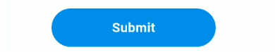

# 🌟 Flutter Awesome Buttons for Flutter

Welcome to **Flutter Awesome Buttons**, your go-to package for an array of stunning and versatile buttons in Flutter! From stylish icons to eye-catching gradients, we’ve got a button for every occasion.

## 🚀 Getting Started

To integrate **Flutter Awesome Buttons** into your Flutter project, simply add it to your `pubspec.yaml` file:

```yaml
dependencies:
  awesome_flutter_buttons: ^<latest_version>
```

## 🎨 Available Buttons

Explore our collection of beautifully crafted buttons designed to enhance your app's UI:

### 1. **Awesome Rounded Button** 🔵

A modern, rounded button that’s perfect for any action.

```dart
AwesomeRoundedButton(
  text: "Submit",
  backgroundColor: Colors.blue,
  onPressed: () {
    print("Button clicked!");
  },
)
```

### 2. **Awesome Bordered Button** 🟢

Add a stylish border to your button with customizable colors and sizes.

```dart
AwesomeBorderedButton(
  text: "Submit",
  borderColor: Colors.blue,
  onPressed: () {
    print("Button clicked!");
  },
)
```

### 3. **Awesome Icon Button** 🚀

A button with an icon, perfect for actions that need a visual cue.

```dart
AwesomeIconButton(
  onPressed: () {
    print("Button clicked!");
  },
  imageUrl: 'https://example.com/icon.png',
  backgroundColor: Colors.blue,
  isNetworkImage: true,
)
```

### 4. **Awesome Icon Text Button** 📌

Combine text and an icon in a button with adjustable icon placement.

```dart
AwesomeIconTextButton(
  text: "Submit",
  iconUrl: 'https://example.com/icon.png',
  isNetworkImage: true,
  iconOnRight: false,
  backgroundColor: Colors.blue,
  onPressed: () {
    print("Button clicked!");
  },
)
```

### 5. **Awesome Loader Button** ⏳

A button with a loading spinner, ideal for async operations.

```dart
AwesomeLoaderButton(
  title: "Submit",
  onPressed: () async {
    // Your async function here
  },
  onSuccess: (response) {
    // Handle success
  },
  onFailure: () {
    // Handle failure
  },
  loadingWidget: const CircularProgressIndicator(),
)
```

### 6. **Awesome Dotted Button** 🔵

A button with a dotted border, adding a unique touch to your UI.

```dart
AwesomeDottedButton(
  text: 'Click Me',
  borderColor: Colors.blue,
  borderRadius: 12.0,
  isLoading: false,
  onPressed: () {
    print('Button Pressed!');
  },
)
```

### 7. **Awesome Caption Text Button** 📝

A button with a caption and customizable styles.

```dart
AwesomeCaptionTextButton(
  text: 'Click Me',
  backgroundColor: Colors.blue,
  borderRadius: 8,
  borderWidth: 2.0,
  icon: Icon(Icons.touch_app, color: Colors.white),
  isLoading: false,
  onPressed: () {
    print('Button Pressed!');
  },
  label: 'This is a caption',
  labelStyle: TextStyle(
    color: Colors.blueGrey,
    fontSize: 12.0,
    fontWeight: FontWeight.w500
  ),
)
```

### 8. **Awesome Gradient Button** 🌈

A vibrant button with a gradient background.

```dart
AwesomeGradientButton(
  text: 'Click Me',
  gradient: LinearGradient(
    colors: [Colors.blue, Colors.purple],
    begin: Alignment.topLeft,
    end: Alignment.bottomRight,
  ),
  borderRadius: 25.0,
  borderWidth: 2.0,
  isLoading: false,
  onPressed: () {
    print('Button Pressed!');
  },
  loaderColor: Colors.white,
)
```

### 9. **Awesome Animated Button** ✨

A dynamic button with an animated touch.

```dart
AwesomeAnimatedButton(
  text: 'Click Me',
  backgroundColor: Colors.blue,
  borderRadius: 8.0,
  elevation: 5.0,
  onPressed: () {
    print('Button Pressed!');
  },
)
```


## Screenshots

<div align="center">
  
  
  <br>
  
  
  <br>
  
  
</div>

